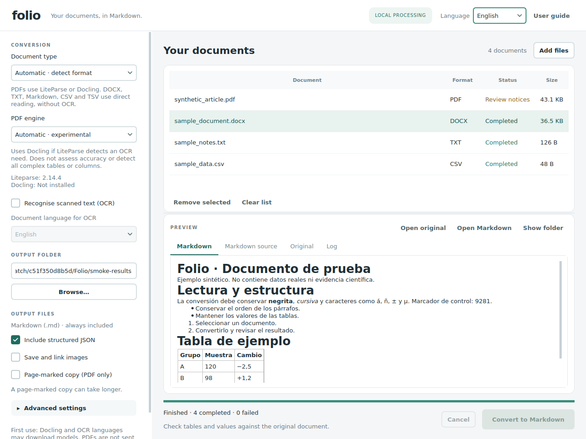
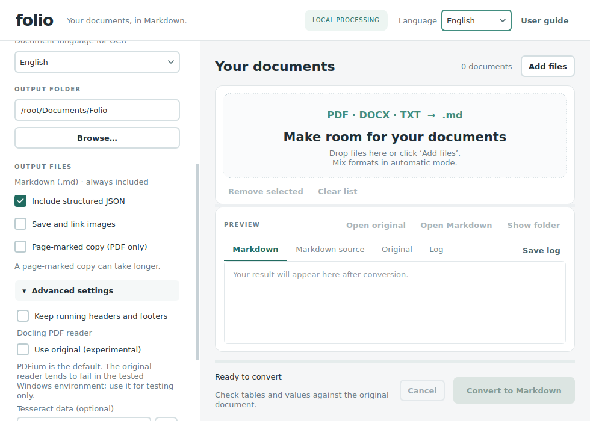

# Folio 0.2.3 — User guide

Local desktop document-to-Markdown converter, with Spanish and English interfaces. Includes Python source, a dependency installer and Windows launchers. This is not a standalone executable.

[Project README](README.md) · [Guía en español](README_ES.md) · [Upgrade notes](UPDATE_0.2.3.md)

Use Folio with openly licensed scientific publications and other documents you are permitted to process. Conversion prepares text for reading and extraction; it does not validate evidence or guarantee better LLM answers.



## New installation on Windows

1. Install **64-bit Python 3.12** from [python.org](https://www.python.org/downloads/windows/), enabling **Add python.exe to PATH**.
2. Extract the entire `Folio` folder to a writable location. Do not run files inside the ZIP.
3. Run `install_windows.cmd`. Choose **1: LiteParse + Docling**, **2: LiteParse**, **3: Docling**, or **4: text documents only**. Every option includes DOCX, TXT, MD, CSV and TSV. Option 4 cannot convert PDFs.
4. Wait for installation into the isolated `.venv` environment, then open `start_windows.cmd`.
5. Run `check_windows.cmd` for automated tests and actual example conversions. It checks installed PDF engines; the Docling smoke test asks before potentially downloading models.

**Updating from 0.1:** extract this release into a new folder, run its installer to add `python-docx`, and use the new launcher. Previous results remain in their output folder. Settings, including the output folder, persist; the new document type defaults to Automatic. Keep the old version until you have checked the update.

LiteParse is the lighter PDF installation. Docling may require several GB for dependencies and models. Folio uses CPU and needs no GPU configuration. Installation requires internet and records resolved versions in `installed-versions.txt`.

## Update from Folio 0.2.x

Close Folio and back up its folder. Extract the release separately, then copy `folio/`, `tools/` and `diagnose_docling.cmd` over your installation. Compare personal code changes before replacing them. Also replace the three README files, `UPDATE_0.2.3.md`, `VALIDATION.md` and `tests/`; copy `screenshots/` to display the new documentation images locally.

Keep `.venv`, model caches, source documents and results. A working 0.2.x installation does not need its dependencies reinstalled for this update. Start Folio using the usual launcher.

The old reader preference migrates to **PDFium**, without changing the other settings. If you explicitly select the original experimental reader after upgrading, that choice is retained on future launches.

## Docling: PDFium by default

Since 0.2.3, Folio uses **PDFium as Docling's default PDF reader on all platforms**, including when Automatic selects Docling. Docling's layout, table and OCR models are still used; PDFium changes how the PDF is read.

Under **Advanced settings → Docling PDF reader**, leave **Use original (experimental)** unchecked for normal use. The accompanying warning reads:

> PDFium is the default. The original reader tends to fail in the tested Windows environment; use it for testing only.

The original reader produced access-violation and heap-corruption messages in the tested Windows setup. The same affected document was reported to convert with PDFium. This does not establish that every system is affected or guarantee the accuracy of every PDFium conversion. Check tables, numbers and column order against the original.



Recent updates also improved context-menu and selected-text contrast with a dark system palette, added **Save log**, and included a validated Windows shortcut icon. Folio retains its light interface; there is no full dark-theme switch.

## Workflow

1. Click **Add files** or drag documents onto the window. Add one or a batch; duplicate paths are ignored.
2. Choose **Document type → Automatic, PDF or Text**. Automatic detects each file separately and accepts mixed batches. PDF/Text enforce the selected family.
3. For PDFs, choose **LiteParse**, **Docling** or **Automatic** as the PDF engine. OCR and OCR language apply only to PDFs. PDF controls are disabled in Text mode and in automatic batches containing only text documents.
4. Choose the output folder and optional JSON, images or page-marked copy (PDF only).
5. Click **Convert to Markdown**. A separate process handles conversion while the interface stays responsive.
6. Select a result to view Markdown or its source. **Original** previews PDFs and plain text; use **Open original** for the DOCX layout. **Show folder** opens the output files. **Save log** exports the displayed conversion log.

Spanish/English changes the interface immediately without losing selection or the batch summary. It does not translate document content or external technical messages. Native file dialogs may use the operating system language.

## Supported formats and automatic routing

| Input | Conversion |
| --- | --- |
| PDF | Selected LiteParse or Docling engine; PDF signature checked first. |
| DOCX | Direct `python-docx` reading: paragraph/table order, headings, bold/italic, common lists, hyperlinks, simple footnotes/endnotes and optional embedded images. No OCR/models. |
| TXT, TEXT, LOG | Direct text reading, escaping Markdown syntax so literal symbols and numbering remain text. |
| MD, MARKDOWN | Preserves Markdown syntax and normalizes encoding to UTF-8. Linked assets are not copied. |
| CSV, TSV | Markdown tables preserving quoted fields, embedded newlines and values. CSV detects comma, semicolon or tab delimiters. Does not reformat decimal values or assume the first row is a header. |

Legacy DOC, RTF, ODT, XLSX and HTML are unsupported. Save as DOCX/TXT or export tables as CSV/TSV first; renaming the extension is insufficient.

Detection uses PDF/DOCX signatures; other formats require a supported extension and valid text content. UTF-8 and BOM-marked UTF-16/32 are supported. If UTF-8 fails, Windows-1252 is tried with a visible notice to check accents and symbols. Save other encodings as UTF-8. Binary files renamed to TXT are rejected.

**Document type → Automatic** detects the format. The separate **PDF engine → Automatic** setting uses `LiteParse.is_complex()` as a heuristic: if it indicates an OCR need and Docling is installed, choose Docling; otherwise LiteParse. If only one engine is available, use it and log the reason. This does not assess accuracy or reliably detect every complex table. Manual engine choices never silently fall back to another engine.

## Outputs

Each successful conversion creates a uniquely named folder. Originals and previous outputs are never overwritten.

| File | Contents |
| --- | --- |
| `document.md` | Main Markdown, UTF-8. |
| `conversion.json` | Always included: source name/SHA-256, detected format, method, settings, versions, elapsed time, status and notices. |
| `structure.json` | Optional. Docling's native document structure; LiteParse's public API snapshot and available coordinates; or `folio.text.v1` blocks, rows or text. These schemas are not interchangeable. |
| `images/` | Optional exported images with relative Markdown links. |
| `document.pages.md` | PDF only: additional copy without images, with `<!-- PDF page: 1 -->` markers. Physical PDF order may differ from printed numbering. |

Text documents have `pages: null`; no physical pagination is invented. DOCX blocks have document-order indices. Optional headers/footers are appended, without physical page mapping.

Keep Markdown and exported images together. Input Markdown keeps its links but linked assets are not copied. The preview does not download remote resources or follow links; it only loads supported local images inside the result folder. Preview size is limited to 2 MB; exported files are not truncated.

## Limits

- **DOCX:** merged cells are expanded and can repeat content; nested tables are flattened; complex numbering is normalized, with notices. Text boxes, equations, charts, embedded objects, content controls and tracked changes can lose structure or be omitted. Accept/reject tracked changes in Word before converting a final version. Simple footnote/endnote text is included; complex note structure is not guaranteed. Images are not described or OCR-processed.
- **PDF:** verify columns, multi-level/multipage tables, figures, values, symbols and small notes. LiteParse uses rules; Docling uses local layout/table models. Neither guarantees fidelity. LiteParse's page-marked export reparses each page and may take longer; it does not stitch multipage tables.
- **TXT/CSV:** no semantic interpretation or inferred headings. CSV/TSV retains every source row and uses an empty Markdown header rather than inventing column names or discarding data.
- Conversion does not interpret clinical evidence or validate LLM answers. Compare results against originals before extracting data.

## Errors, cancellation and local processing

**Cancel** stops the active process and retains completed results. The current document may leave a `.partial_...` folder marked incomplete/failed; it is not a successful result and is not automatically deleted. A handled per-file error does not stop the rest of a batch; an abrupt native process crash does. Convert again to retry pending files. To repeat completed files, clear the queue and add them again. The queue is not saved on exit; settings and output files persist.

Documents are processed locally, without an LLM API or uploading files to a conversion service. DOCX/TXT/MD/CSV/TSV conversion requires no runtime downloads. Installation downloads packages; Docling/EasyOCR and OCR language data can download on first use and then reuse caches. Remote Docling services and standard Hugging Face telemetry are disabled in the conversion process. Folio does not enforce a firewall.

Advanced settings accept prepared Tesseract data and Docling model folders. The Docling folder does not replace EasyOCR's cache. Before offline use, prepare every engine/language and verify a disconnected conversion. Encrypted/protected PDFs may fail; use a legitimately accessible copy.

## Troubleshooting

| Problem | Action |
| --- | --- |
| Window does not open | Run `debug_windows.cmd` and check setup completed. |
| Missing python-docx after updating | Run this release's installer; every option includes it. |
| Missing PDF engine | Rerun setup for that engine and restart Folio. Text documents still work. |
| Document type mismatch | Use Automatic for mixed batches. |
| Convert is disabled after completion | Clear the queue and re-add files you want to repeat. |
| Wrong accents | Save the source as UTF-8 and retry. |
| Docling fails with the original reader | Uncheck **Use original (experimental)** to restore PDFium, then retry. |
| Conversion stops unexpectedly | Use **Save log** and run the independent diagnostic below. |
| Conversion finishes but native exceptions appear | Review the log and output. Completion does not establish a clean run or content fidelity. |
| Model/dependency download error | Check 64-bit Python 3.12, connectivity, disk space and corporate configuration. Do not disable certificate validation. |
| Poor conversion | Review the original; compare PDF engines. Simplify complex DOCX elements or export a PDF copy. |

### Independent Docling diagnostic

Double-click `diagnose_docling.cmd`. Choose **P** for PDFium, then whether to enable OCR. **O** selects the original experimental reader. The default source is the included synthetic PDF. Each run creates a unique folder under `diagnostics/` with `diagnostic.json` (environment, settings, outcome and native exception counts), `worker.log` and any completed outputs. These reports are separate from `conversion.json`.

From a terminal opened in the Folio folder:

```bat
.venv\Scripts\python.exe tools\diagnose_docling.py
.venv\Scripts\python.exe tools\diagnose_docling.py --ocr
.venv\Scripts\python.exe tools\diagnose_docling.py --source "C:\path\document.pdf"
.venv\Scripts\python.exe tools\diagnose_docling.py --original-reader
```

PDFium is the default. `--pdfium` explicitly selects it; `--original-reader` is for experimental comparisons only. On macOS/Linux use `.venv/bin/python` instead.

| Status | Meaning | Diagnostic exit code |
| --- | --- | --- |
| `completed` | Conversion finished without detected native exception messages; content fidelity is not verified. | 0 |
| `completed_with_native_notices` | Conversion finished but native exception messages require review. | 2 |
| `failed` / `cancelled` | Failed, unconfirmed completion or cancelled diagnostic. | 1 |

A Windows exception dump can appear before the worker subsequently exits normally. Qt's `CrashExit` confirms an abnormal termination, but its raw exit value is not guaranteed valid in that state. The independent diagnostic captures the operating-system return code. Ordinary deprecation and cache warnings alone do not establish a crash.

The diagnostic does not reinstall packages, clear caches or upload documents or logs. It may download models. Review personal file names and paths before sharing `diagnostic.json` and `worker.log`.

## Windows shortcut icon

`folio/assets/folio.ico` contains seven sizes (16–256 pixels). Create a shortcut to `start_windows.cmd`, then right-click the **shortcut** and choose **Properties → Shortcut → Change Icon → Browse**. Select the ICO and apply. Keep it in a permanent location. The original `.cmd` file does not automatically change icon. Qt uses the PNG in the same assets folder.

## macOS/Linux and Python API

From the extracted folder, using Python 3.12:

```bash
python3 tools/bootstrap.py --engine both
.venv/bin/python main.py
```

Other installer choices: `--engine liteparse`, `--engine docling`, `--engine text`. The installer accepts 64-bit Python 3.10–3.13; not every dependency combination has been tested. Linux may need Qt system libraries. Full native installation, DPI and launcher validation on Windows/macOS remains limited.

```python
from pathlib import Path
from folio.core import Options, convert_file

for name in ("article.pdf", "report.docx", "notes.txt"):
    result = convert_file(
        Path(name), Path("results"),
        Options(document_type="auto", engine="auto", ocr_language="eng"),
    )
    print(result["markdown"])
```

`Options(engine="docling")` uses PDFium by default. Use `docling_pdfium=False` only when explicitly testing the original reader. This setting does not change LiteParse or direct text conversion.

Using the `.venv` interpreter:

```bash
python -m unittest discover -s tests -v
python tools/smoke_test.py --engine text
python tools/smoke_test.py --engine liteparse
python tools/smoke_test.py --engine docling
python tools/smoke_test.py --engine liteparse --ocr
```

Folio 0.2.3 passed **69 automated tests with no skips** in the Linux development environment, including Qt, DOCX/text conversions, reader defaults, preference migration and diagnostics. An actual LiteParse conversion was repeated successfully. Earlier releases also exercised a mixed-file GUI batch. **Docling adapter tests use test doubles; Docling/OCR were not executed in that development verification.** A user reported a successful Docling/PDFium conversion on Windows with 0.2.2; 0.2.3 changes the default selection and interface, not that reader implementation. See [VALIDATION.md](VALIDATION.md). Synthetic examples and smoke tests do not establish accuracy on your documents.

## Licenses and references

Own code: MIT. Dependencies and models retain their licenses; no dependency binaries or model weights are included. LiteParse: Apache-2.0; Docling/python-docx: MIT; PySide6: LGPLv3/GPLv3 or commercial.

Official documentation: [LiteParse](https://github.com/run-llama/liteparse), [LiteParse OCR](https://developers.llamaindex.ai/liteparse/guides/ocr/), [Docling](https://github.com/docling-project/docling), [Docling offline setup](https://docling-project.github.io/docling/usage/advanced_options/), [python-docx](https://python-docx.readthedocs.io/en/latest/api/document.html), [Qt stylesheets](https://doc.qt.io/qt-6/stylesheet-examples.html).
