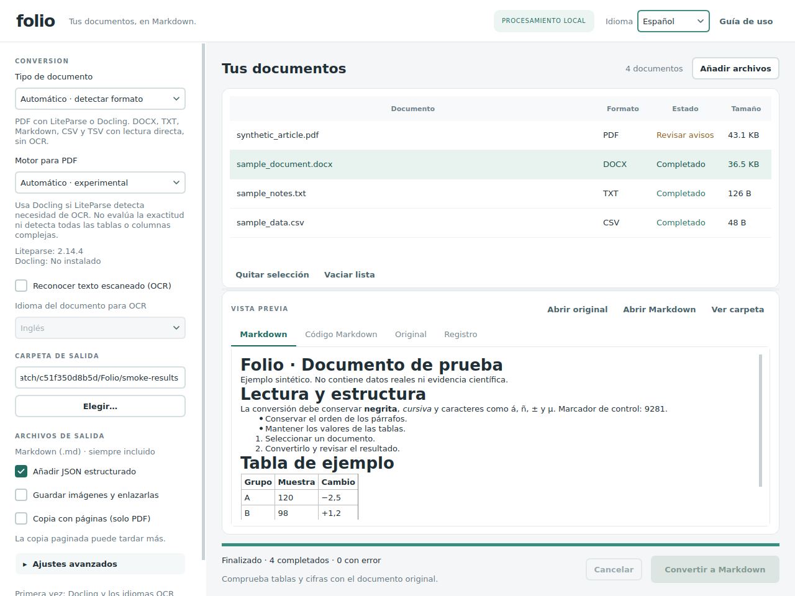
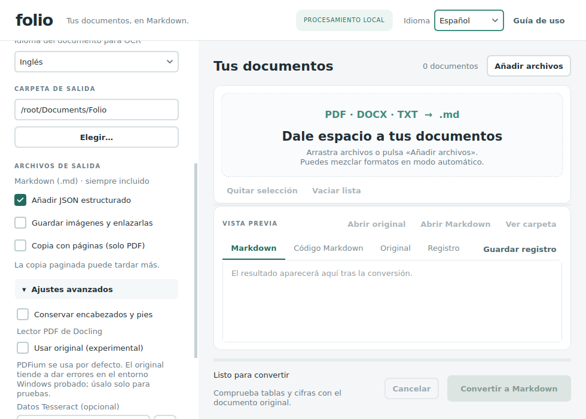

# Folio 0.2.3 — Guía de uso

Convierte documentos en Markdown desde una aplicación de escritorio local, con interfaz en español e inglés. Incluye código Python, instalador de dependencias y lanzadores para Windows. No es un ejecutable autónomo.

[README del proyecto](README.md) · [English user guide](README_EN.md) · [Notas de actualización](UPDATE_0.2.3.md)

Utiliza Folio con publicaciones científicas con licencias abiertas y otros documentos cuyo tratamiento tengas permitido. La conversión prepara el texto para su lectura y extracción; no valida la evidencia ni garantiza mejores respuestas de un LLM.



## Instalación nueva en Windows

1. Instala **Python 3.12 de 64 bits** desde [python.org](https://www.python.org/downloads/windows/), activando **Add python.exe to PATH**.
2. Descomprime toda la carpeta `Folio` en una ubicación con permisos de escritura, por ejemplo `Documentos\FolioApp`. No ejecutes el programa desde dentro del ZIP.
3. Abre `install_windows.cmd`. Puedes elegir **1: LiteParse + Docling**, **2: LiteParse**, **3: Docling** o **4: solo documentos de texto**. Todas las opciones incluyen DOCX, TXT, MD, CSV y TSV. La opción 4 no convierte PDF.
4. Espera a que termine la instalación en el entorno aislado `.venv`. Después abre `start_windows.cmd`.
5. `check_windows.cmd` ejecuta las pruebas, convierte los ejemplos de texto y comprueba los motores PDF instalados. Docling se prueba solo si aceptas la descarga de modelos que pueda necesitar.

**Si vienes de Folio 0.1:** extrae esta versión en una carpeta nueva y ejecuta su instalador para añadir `python-docx`. Abre el lanzador de la carpeta nueva. Tus resultados anteriores siguen en su carpeta; las preferencias se mantienen, incluida la carpeta de salida. El tipo de documento nuevo aparece en Automático. Conserva la versión anterior hasta comprobar la nueva.

LiteParse es la instalación PDF más ligera. Docling instala más dependencias y puede necesitar varios GB para paquetes y modelos. El programa utiliza CPU; no necesitas configurar una GPU. La instalación requiere conexión y guarda las versiones resueltas en `installed-versions.txt`.

## Actualizar desde Folio 0.2.x

Cierra Folio y guarda una copia de su carpeta. Extrae la versión nueva aparte y copia `folio/`, `tools/` y `diagnose_docling.cmd` sobre tu instalación. Si has personalizado el código, compara tus cambios antes de reemplazarlo. Sustituye también los tres README, `UPDATE_0.2.3.md`, `VALIDATION.md` y `tests/`; copia `screenshots/` si quieres visualizar localmente las nuevas capturas de la documentación.

Conserva `.venv`, las cachés de modelos, los originales y los resultados. Una instalación 0.2.x que ya funciona no requiere reinstalar dependencias para esta actualización. Abre Folio con tu lanzador habitual.

La preferencia antigua del lector se cambia a **PDFium**, sin modificar los demás ajustes. Si después eliges expresamente el lector original experimental, esa elección se conserva al reiniciar.

## Docling: PDFium por defecto

Desde 0.2.3, Folio utiliza **PDFium como lector PDF predeterminado de Docling en todos los sistemas**, también cuando el modo Automático selecciona Docling. Se mantienen los modelos de estructura, tablas y OCR de Docling; PDFium cambia la forma de leer el PDF.

En **Ajustes avanzados → Lector PDF de Docling**, deja **Usar original (experimental)** desmarcado para el uso habitual. Debajo aparece esta advertencia:

> PDFium se usa por defecto. El original tiende a dar errores en el entorno Windows probado; úsalo solo para pruebas.

El lector original produjo mensajes de acceso inválido y corrupción de memoria en el entorno Windows probado. El usuario confirmó la conversión del mismo documento con PDFium. Esto no demuestra que todos los equipos estén afectados ni garantiza la fidelidad de cualquier conversión con PDFium. Comprueba tablas, cifras y orden de columnas frente al original.



Las actualizaciones recientes también mejoraron el contraste de los menús contextuales y del texto seleccionado con una paleta oscura del sistema, añadieron **Guardar registro** e incorporaron un icono de acceso directo validado. Folio conserva su interfaz clara; no incorpora un selector de tema oscuro completo.

## Uso

1. Pulsa **Añadir archivos** o arrástralos a la ventana. Puedes añadir un documento o un lote y no se duplican rutas ya añadidas.
2. En **Tipo de documento**, elige **Automático**, **PDF** o **Texto**. Automático permite mezclar formatos y reconoce cada archivo por separado. Los modos PDF/Texto comprueban que el archivo corresponde a la familia elegida.
3. Para PDF, selecciona **LiteParse**, **Docling** o el motor **Automático**. OCR y su idioma solo se aplican a PDF; no traducen el documento. Los controles PDF se desactivan en modo Texto y en lotes automáticos que solo contienen texto.
4. Elige la carpeta de salida y, si quieres, JSON estructurado, imágenes o copia con páginas (solo PDF).
5. Pulsa **Convertir a Markdown**. La interfaz sigue respondiendo mientras un proceso separado convierte el lote.
6. Selecciona un resultado para leer el Markdown y ver su código. **Original** muestra PDF y texto plano; para ver el diseño de un DOCX pulsa **Abrir original**. **Ver carpeta** abre los archivos generados. **Guardar registro** exporta el registro de conversión mostrado.

El selector **Español / English** cambia la interfaz al instante y recuerda el idioma, sin perder la selección ni el resumen del lote. No traduce el contenido ni los mensajes técnicos externos; los diálogos nativos pueden seguir el idioma del sistema.

## Formatos y modo automático

| Entrada | Método y resultado |
| --- | --- |
| PDF | LiteParse o Docling, según el motor elegido. Comprueba la firma PDF antes de procesar. |
| DOCX | Lectura directa con `python-docx`: orden de párrafos y tablas, títulos, negrita/cursiva, listas habituales, enlaces, notas al pie sencillas e imágenes incrustadas opcionales. Sin OCR ni modelos. |
| TXT, TEXT, LOG | Lectura directa. Conserva el texto y escapa la sintaxis Markdown para que símbolos y numeración literales no se interpreten como formato. |
| MD, MARKDOWN | Conserva la sintaxis Markdown y normaliza la codificación a UTF-8. No copia archivos vinculados. |
| CSV, TSV | Tabla Markdown, respetando campos entrecomillados, saltos de línea y valores. En CSV detecta coma, punto y coma o tabulador; no convierte decimales ni supone que la primera fila sea una cabecera. |

**No se admiten DOC antiguo, RTF, ODT, XLSX ni HTML.** Guarda esos documentos como DOCX/TXT o exporta sus tablas a CSV/TSV antes de añadirlos. No basta con cambiar la extensión.

La detección comprueba las firmas de PDF y DOCX; para el resto utiliza una extensión compatible y valida que el contenido sea texto. Se admiten UTF-8 y UTF-16/32 con BOM. Si UTF-8 falla, intenta Windows-1252 y muestra un aviso para revisar tildes y símbolos. Para otras codificaciones, guarda una copia UTF-8. Los archivos binarios renombrados como TXT se rechazan.

Hay dos decisiones independientes: **Tipo de documento → Automático** reconoce el formato; **Motor para PDF → Automático** decide entre motores PDF. Para PDF, consulta `LiteParse.is_complex()`: si aprecia necesidad de OCR y Docling está instalado, usa Docling; de lo contrario, LiteParse. Si solo está instalado un motor, lo usa y registra el motivo. Esta heurística no mide la exactitud ni detecta todas las tablas complejas. El motor manual nunca se sustituye silenciosamente.

## Qué archivos se generan

Cada conversión crea una carpeta nueva con el nombre del documento, método e identificador único. Los originales y los resultados anteriores no se sobrescriben.

| Archivo | Contenido |
| --- | --- |
| `document.md` | Markdown principal en UTF-8. |
| `conversion.json` | Siempre incluido: SHA-256 y nombre del original, formato detectado, método, ajustes, versiones, duración, estado y avisos. |
| `structure.json` | Opcional. Docling exporta su estructura nativa; LiteParse exporta una instantánea de campos públicos y coordenadas disponibles; texto usa `folio.text.v1` con bloques, filas o texto. Los esquemas no son equivalentes. |
| `images/` | Imágenes exportadas y enlazadas con rutas relativas, si se activa la opción y el documento las proporciona. |
| `document.pages.md` | Solo PDF: copia adicional sin imágenes y con comentarios `<!-- PDF page: 1 -->`. No necesariamente coincide con la numeración impresa. |

Los documentos de texto tienen `pages: null`: no se inventa una paginación física. En DOCX el JSON identifica bloques por su orden. Los encabezados/pies opcionales se añaden al final; no se asocian a páginas.

Mantén juntos el Markdown y la carpeta de imágenes. Los MD de entrada conservan sus enlaces, pero los recursos vinculados no se copian. La vista previa no descarga recursos remotos ni sigue enlaces y solo muestra imágenes locales admitidas dentro de la carpeta del resultado. Se limita a 2 MB; el archivo exportado no se trunca.

## Límites que conviene conocer

- **DOCX:** celdas combinadas se expanden y pueden repetir contenido; tablas anidadas se aplanan; numeraciones complejas se normalizan. El programa muestra avisos. Cuadros de texto, ecuaciones, gráficos, objetos incrustados, controles de contenido y cambios pendientes pueden omitirse o perder estructura. Acepta/rechaza los cambios en Word antes de convertir si quieres una versión final. Se admite texto de notas al pie/al final, pero no se garantiza toda su estructura compleja. Las imágenes no se describen ni se pasan por OCR.
- **PDF:** verifica columnas, tablas multinivel o multipágina, símbolos, cifras y notas pequeñas. LiteParse reconstruye Markdown con reglas; Docling usa modelos locales de estructura y tablas. Ninguno garantiza fidelidad perfecta. La copia paginada de LiteParse vuelve a procesar cada página y puede tardar más; no une tablas multipágina.
- **TXT/CSV:** no hay interpretación semántica ni reconstrucción de títulos a partir del aspecto. CSV/TSV conserva las filas originales y usa una cabecera Markdown vacía para no inventar nombres ni descartar datos.
- La conversión no extrae conclusiones clínicas, valida evidencia ni verifica respuestas de LLM. Comprueba los resultados contra el original antes de extraer datos.

## Errores, cancelación y privacidad

**Cancelar** detiene el proceso activo y conserva resultados terminados. El documento actual puede dejar una carpeta `.partial_...` marcada como incompleta o fallida: no es un resultado correcto. No se borra automáticamente. Un error controlado de un archivo permite procesar el resto; un cierre nativo inesperado del proceso detiene el lote. Vuelve a pulsar Convertir para reintentar los pendientes. Para repetir los completados, vacía la lista y añádelos de nuevo. La cola no se conserva al cerrar; los ajustes y resultados sí.

La conversión se hace localmente, sin API de LLM ni envío de documentos a un servicio. **DOCX/TXT/MD/CSV/TSV no necesitan descargas al convertir.** La instalación descarga paquetes; Docling/EasyOCR y los idiomas OCR pueden descargar modelos la primera vez. Después reutilizan las cachés. Los servicios remotos de Docling se desactivan y el proceso desactiva la telemetría estándar de Hugging Face. La aplicación no impone un cortafuegos.

En Ajustes avanzados puedes seleccionar datos Tesseract y modelos Docling ya descargados. La carpeta de Docling no sustituye por sí sola la caché de EasyOCR. Para trabajar sin conexión, prepara cada motor/idioma que usarás y comprueba una conversión desconectado. Los PDF cifrados o protegidos pueden fallar; usa una copia accesible legítimamente.

## Solución de problemas

| Problema | Solución |
| --- | --- |
| La ventana no abre | Ejecuta `debug_windows.cmd` y comprueba que la instalación terminó. |
| Falta `python-docx` tras actualizar | Ejecuta el instalador de esta versión; todas las opciones lo incluyen. |
| Falta LiteParse o Docling | Repite el instalador eligiendo el motor y reinicia Folio. Los archivos de texto siguen pudiendo convertirse. |
| No coincide el tipo | Cambia Tipo de documento a Automático para un lote mixto. |
| No puedo volver a pulsar Convertir | Si todo terminó, vacía la lista y añade de nuevo los archivos que quieres repetir. |
| Acentos extraños | Guarda el original como UTF-8 y conviértelo de nuevo. |
| Docling falla con el lector original | Desmarca **Usar original (experimental)** para volver a PDFium y reintenta. |
| La conversión se detiene inesperadamente | Usa **Guardar registro** y ejecuta el diagnóstico independiente descrito abajo. |
| La conversión termina pero aparecen excepciones nativas | Revisa el registro y el resultado. Terminar no garantiza ausencia de incidencias ni fidelidad del contenido. |
| Error de modelos o dependencias | Revisa Python 3.12 de 64 bits, conectividad, espacio y configuración corporativa. No desactives certificados. |
| Resultado poco fiel | Revisa el original; para PDF compara motores. Para DOCX simplifica los elementos complejos o exporta una copia PDF. |

### Diagnóstico independiente de Docling

Haz doble clic en `diagnose_docling.cmd`. Elige **P** para PDFium y después si quieres activar OCR. **O** selecciona el lector original experimental. Se usa el PDF sintético incluido. Cada ejecución crea una carpeta independiente en `diagnostics/` con `diagnostic.json` (entorno, ajustes, resultado y número de mensajes nativos), `worker.log` y los resultados que hayan terminado. Estos informes son distintos de `conversion.json`.

Desde una terminal abierta en la carpeta de Folio:

```bat
.venv\Scripts\python.exe tools\diagnose_docling.py
.venv\Scripts\python.exe tools\diagnose_docling.py --ocr
.venv\Scripts\python.exe tools\diagnose_docling.py --source "C:\ruta\documento.pdf"
.venv\Scripts\python.exe tools\diagnose_docling.py --original-reader
```

PDFium es el predeterminado. `--pdfium` lo selecciona expresamente; `--original-reader` se reserva para comparaciones experimentales. En macOS/Linux utiliza `.venv/bin/python`.

| Estado | Significado | Código de salida del diagnóstico |
| --- | --- | --- |
| `completed` | Conversión terminada sin mensajes nativos detectados; no verifica la fidelidad del contenido. | 0 |
| `completed_with_native_notices` | Conversión terminada con mensajes de excepciones nativas que deben revisarse. | 2 |
| `failed` / `cancelled` | Fallo, finalización no confirmada o diagnóstico cancelado. | 1 |

En Windows puede aparecer una traza de excepción y después finalizar el proceso normalmente. `CrashExit` de Qt sí indica un cierre anómalo, pero su valor numérico bruto no está garantizado en ese estado. El diagnóstico independiente recoge el código de salida del sistema operativo. Los avisos ordinarios de deprecación o caché no demuestran por sí solos un cierre fatal.

El diagnóstico no reinstala paquetes, borra cachés ni sube documentos o registros. Puede descargar modelos. Revisa nombres y rutas personales antes de compartir `diagnostic.json` y `worker.log`.

## Icono de acceso directo en Windows

`folio/assets/folio.ico` contiene siete tamaños (16–256 píxeles). Crea un acceso directo a `start_windows.cmd` y, sobre el **acceso directo**, haz clic derecho → **Propiedades → Acceso directo → Cambiar icono → Examinar**. Selecciona el ICO y aplica. Consérvalo en una ubicación permanente. El archivo `.cmd` original no cambia de icono automáticamente. Qt utiliza el PNG de la misma carpeta de recursos.

## macOS/Linux y Python

Desde la carpeta extraída, con Python 3.12:

```bash
python3 tools/bootstrap.py --engine both
.venv/bin/python main.py
```

También puedes usar `--engine liteparse`, `--engine docling` o `--engine text`. El instalador acepta Python 3.10–3.13 de 64 bits; no se ha probado cada combinación de dependencias. Linux puede requerir bibliotecas del sistema para Qt. La comprobación completa de instalaciones, lanzadores y escalado DPI nativos en Windows/macOS sigue siendo limitada.

```python
from pathlib import Path
from folio.core import Options, convert_file

for name in ("articulo.pdf", "informe.docx", "notas.txt"):
    result = convert_file(
        Path(name), Path("resultados"),
        Options(document_type="auto", engine="auto", ocr_language="spa"),
    )
    print(result["markdown"])
```

`Options(engine="docling")` utiliza PDFium por defecto. Reserva `docling_pdfium=False` para probar expresamente el lector original. Este ajuste no cambia LiteParse ni la conversión directa de texto.

Con el Python de `.venv`, puedes ejecutar:

```bash
python -m unittest discover -s tests -v
python tools/smoke_test.py --engine text
python tools/smoke_test.py --engine liteparse
python tools/smoke_test.py --engine docling
python tools/smoke_test.py --engine liteparse --ocr
```

Folio 0.2.3 pasó **69 pruebas automatizadas, sin omisiones**, en el entorno Linux de desarrollo: Qt, conversión DOCX/texto, valores iniciales del lector, migración de preferencias y diagnósticos. Se repitió correctamente una conversión real con LiteParse. En versiones anteriores se comprobó también un lote mixto desde la interfaz. **Las pruebas del adaptador Docling usan dobles de prueba; no ejecutan Docling/OCR en ese entorno.** El usuario confirmó una conversión real con Docling/PDFium en Windows con 0.2.2; 0.2.3 cambia la selección inicial y la interfaz, no esa implementación del lector. Consulta [VALIDATION.md](VALIDATION.md). Los ejemplos sintéticos no equivalen a validación de fidelidad con tus documentos.

## Licencias y fuentes

Código propio MIT. Los paquetes y modelos conservan sus licencias; no se redistribuyen sus binarios ni pesos. Entre otros: LiteParse Apache-2.0, Docling y python-docx MIT, PySide6 LGPLv3/GPLv3 o licencia comercial.

Documentación oficial: [LiteParse](https://github.com/run-llama/liteparse), [OCR LiteParse](https://developers.llamaindex.ai/liteparse/guides/ocr/), [Docling](https://github.com/docling-project/docling), [uso sin conexión de Docling](https://docling-project.github.io/docling/usage/advanced_options/), [python-docx 1.2](https://python-docx.readthedocs.io/en/latest/api/document.html), [Qt Stylesheets](https://doc.qt.io/qt-6/stylesheet-examples.html).
